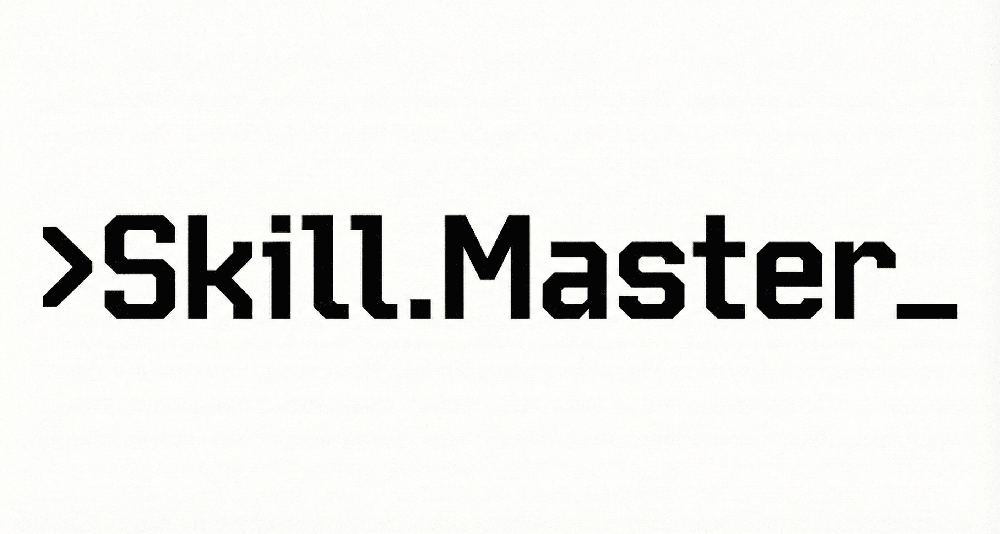

<p align="center">
  
</p>

<p align="center">
  <strong>"Where Natural Language becomes Turing Complete"</strong>
</p>

<p align="center">
  <a href="#overview">Overview</a> •
  <a href="#quick-start">Quick Start</a> •
  <a href="#how-it-works">How It Works</a> •
  <a href="#the-turing-machine-parallel">Philosophy</a> •
  <a href="#skills-included">Skills</a>
</p>

---

## Overview

**Skill Master** is an intelligent skill orchestrator for Claude Code that automatically **finds**, **creates**, **executes**, and **improves** skills based on actual usage.

Inspired by the **Turing Machine**, Skill Master treats skills as a "tape" that can be read, written, and modified - creating a self-improving agent system.

### Two Nested Turing Machines

The system operates as two nested Turing machines:

| Level | Tape | Head | Instructions |
|-------|------|------|--------------|
| **Agent TM** (L2) | Skill Repository | Skill Master | Search → Create → Execute → Review → Improve |
| **LLM TM** (L1) | LLM Context | LLM Model | Training + Prompts |

- **L1 (Foundation):** The LLM processes tokens in its context window
- **L2 (Agent):** Skill Master manages skills as a higher-level "tape"
- The Agent TM executes via the LLM TM, achieving Turing-completeness at both levels

### What It Does

1. **Search** - Finds existing skills (local, GitHub, web)
2. **Create** - Generates new skills through deep research when none exist
3. **Execute** - Invokes the skill to complete your task
4. **Review** - Compares execution against skill instructions (empirical, not theoretical)
5. **Improve** - Updates skills based on actual divergences

The review is **self-limiting**: if a skill executes perfectly, no improvement is needed. Skills converge toward optimal instructions through real usage.

---

## Quick Start

### Installation

Register the skill marketplace in Claude Code:

```bash
/plugin marketplace add zysilm-ai/skill-master
```

Or for local installation, clone and register:

```bash
git clone https://github.com/zysilm-ai/skill-master.git
cd skill-master
/plugin marketplace add ./
```

### Usage

Simply invoke Skill Master with your task:

```
/skill-master Create a business plan for an electric motorcycle startup
```

Or let Claude Code auto-detect based on context:

```
Invoke skill-master to create a comprehensive market analysis for renewable energy in Europe
```

Skill Master will:
1. Search for a matching skill
2. Create one if not found (after researching best practices)
3. Ask where to store it (local or global)
4. Execute the skill to complete your task
5. Review and offer improvements based on execution

### Feedback & Improvement

If you later find issues with the output and want to **both fix the output AND improve the skill**, invoke Skill Master again with your feedback:

Using command:
```
/skill-master please fix the business plan, the financial projections section needs more detail
```

Using natural language:
```
Invoke skill-master to adjust the market analysis - add competitor pricing data and export to PDF
```

Skill Master will:
1. Fix your output immediately
2. Link the feedback to the skill that created it
3. Improve the skill so future executions are better

---

## How It Works

### The Workflow

```
User Request
     │
     ▼
┌─────────────┐     ┌─────────────┐     ┌─────────────┐
│   SEARCH    │────▶│   CREATE    │────▶│   EXECUTE   │
│   Skills    │     │   if none   │     │   Skill     │
└─────────────┘     └─────────────┘     └─────────────┘
                                              │
                                              ▼
                                        ┌─────────────┐
                                        │   REVIEW    │
                                        │  (fresh agent)
                                        └─────────────┘
                                              │
                          ┌───────────────────┴───────────────────┐
                          │                                       │
                          ▼                                       ▼
                   No Divergence                            Divergence Found
                          │                                       │
                          ▼                                       ▼
                      ┌───────┐                            ┌─────────────┐
                      │ DONE  │                            │   IMPROVE   │
                      └───────┘                            │   Skill     │
                                                           └─────────────┘
```

### Empirical Review

The review phase is **empirical, not theoretical**:

- Compares what the skill **says to do** vs what **actually happened**
- Uses a **fresh agent** (via Task tool) for unbiased comparison
- Only suggests improvements when execution **diverged** from instructions
- User decides whether to apply improvements

This ensures skills improve based on **real issues**, not arbitrary criteria.

---

### Feedback & Adjustment

#### The Problem

After a skill completes successfully, you might find issues with the output later:
- Content quality not meeting expectations
- Missing sections or details
- Format needs adjustment (e.g., export to PDF)

The skill executed perfectly (no divergences), but the **output needs improvement**.

#### The Solution

Manually invoke Skill Master with your feedback to **both fix the output AND improve the skill**:

```
/skill-master please fix the market report, the competitive analysis section is too shallow
```

Or:

```
Invoke skill-master to adjust the documentation - add more code examples and export to PDF
```

#### How It Works

```
User feedback request
        │
        ▼
┌─────────────────────┐
│   FIX THE OUTPUT    │ ◄── First, make the changes user requested
└─────────────────────┘
        │
        ▼
┌─────────────────────┐
│  CHECK STATE FILE   │ ◄── Look for .skill-master-state.json
└─────────────────────┘
        │
        ├── State exists ──────────────────┐
        │                                  ▼
        │                         ┌─────────────────────┐
        │                         │  REVIEW & IMPROVE   │
        │                         │  - Link to skill    │
        │                         │  - Capture feedback │
        │                         │  - Update skill     │
        │                         └─────────────────────┘
        │
        └── No state ─────────────┐
                                  ▼
                            ┌───────────┐
                            │   Done    │
                            │ (fix only)│
                            └───────────┘
```

#### Why Manual Trigger?

Skills are **stateless** - they don't have access to conversation history. When you say "fix the report", skill-master doesn't automatically know:
- Which skill created it
- What the original execution looked like

By explicitly invoking `/skill-master`, you signal that:
1. This relates to a skill-generated output
2. You want the skill improved, not just the output fixed

### State Tracking

Skill Master maintains execution state in `.skill-master-state.json`:

```json
{
  "request": "create a market analysis report",
  "skill_name": "market-research-reports",
  "skill_path": ".claude/skills/market-research-reports",
  "outputs": ["./reports/market-analysis.md"],
  "state": "COMPLETE"
}
```

This enables linking your feedback to the skill that produced the output.

---

## Configuration

Skills can be stored in two locations:

| Location | Scope | Use Case |
|----------|-------|----------|
| `.claude/skills/` | Project | Team-shared, committed to git |
| `~/.claude/skills/` | Personal | Available across all projects |

---

## Contributing

Contributions welcome! Areas for improvement:

- Additional skill templates
- Better search algorithms
- More improvement patterns
- Integration with other agent frameworks

---

## License

MIT License - See [LICENSE](LICENSE)

---

